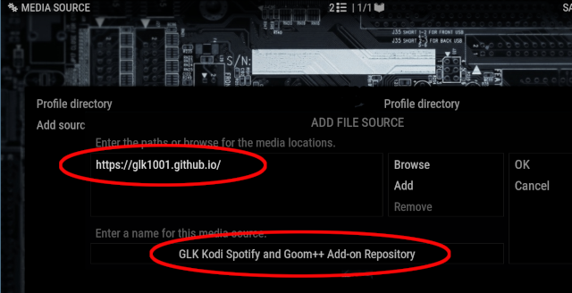
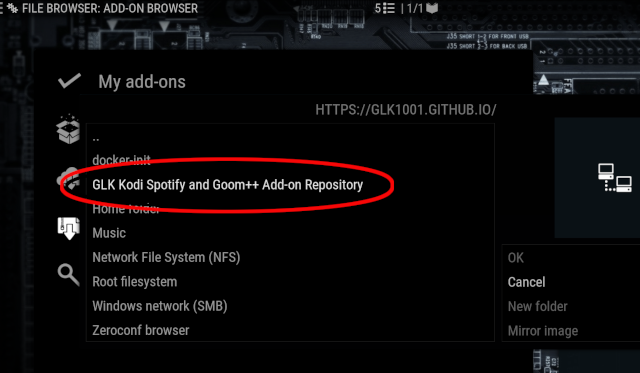

# Glk1001 Spotify for Kodi and Goom++ Add-on Repository

This repository contains two separate Kodi add-ons for Kodi Omega (i.e., Kodi 21):

### <u>Unofficial Spotify for Kodi Add-on</u>

This is the original Unofficial Spotify for Kodi Add-on developed by Marcelveldt and enhanced to work for Kodi Omega
by Ldsz, Elkropac, FernetMenta, and Glk1001. Version 1.3.5+ has had a lot of code cleaning and now uses 'bottle' combined
with 'spotty' to do audio streaming. It's been tested on Ubuntu 24.04, Windows 11, Android 9 (Fire TV Cube),and some other
Arm devices. Not on Mac.

NEW in 1.3.13: Changed the default album retrieval for 'artists' to just albums and singles instead of everything. And added
more logging to figure how many cached/non-cached things the plugin is retrieving. (By default, turned off.)

NEW in 1.3.12: Added a workaround setting "problem_with_terminate_streaming" to not terminate streaming early. This setting
was added for Raspberry Pi users. If you're finding songs skipping or otherwise not playing smoothly, then set
"problem_with_terminate_streaming" to True.

NEW in 1.3.11: Fixed get all albums option for artist. Now gets only albums. Spotify recently made an API change that caused
get albums to get all albums and all 'appears on' tracks. Get singles and get everything for artist options also added.

NEW in 1.3.10: Removed 'user/password' authentication (Spotify removed this mode.) Replaced with zeroconf authentication.

**NOTE:** Version 1.3.10+ is the only version that will now work with the changed Spotify authentication requirements.

NOTE: Will not work on Android 10+ - Google changed permissions making it very difficult for apps to execute binaries.

Source code at: https://github.com/glk1001/plugin.audio.spotify

### <u>Goom++ Visualization Add-on</u>

Based off the original 'C' Goom visualization from Kodi 18, re-written in C++17, with some new effects
and different color handling.

Source code at: https://github.com/glk1001/visualization.goom-pp

## <u>Installing the Add-ons</u>

1. Make sure the Kodi setting *"Settings/Add-ons/Unknown sources"* is set to 'on'.

1. From *"Settings/File Manager",* add the repository "https://glk1001.github.io/" to Kodi: 

1. From *"Settings/Add-ons/Install from zip file",* choose *"GLK Kodi Spotify and Goom++ Add-on Repository",*
then pick the add-on zip you want to install (if you're installing Goom++, then be careful to match the add-on
version to your Kodi version, and the add-on platform to your device platform
(e.g., 'visualization.goom-pp-nexus-linux-x86_64.zip' for Kodi Omega on a 64 bit x86 Linux machine)): 
 
Wait a few minutes for the add-on to install. (A dropdown message-box will appear near the top of the main Kodi
window saying the add-on has been installed.)

1. If you are installing the Spotify add-on, then for the first use of the plugin you'll need to choose the **"Authenticate
   the plugin"** option on the first menu. With this option, you need another official Spotify app (either mobile or desktop)
   connected to your LAN to authenticate the Kodi plugin. (Note: You may need to adjust your firewall for this step.) To do
   this, on the official app, select any track and start playing it. There should now be a 'Connect to device' option. Choose
   this, then select the 'Kodi-Spotty' device. You can now close the app and **press 'OK' on the Kodi dialog box.** If all is
   well, you should get another 'sucessfully authenticated' dialog box.

1. **WARNING:** If you have an already installed the Spotify plugin and you experience errors or menu issues with this new one,
then run the "Clear the plugin cache" option from the first Spotify page. Then restart Kodi.

1. **WARNING:** The Spotify plugin is broken on older versions of Ubuntu 22.04. If you have 'Python 3.10.6' or greater it should be OK.

1. If you are installing the Goom++ add-on, then you'll need to enable Goom++ as the music visualiser. Under
*"Settings/Player/Music/Visualisation",* select *"Goom"* from the drop-down list.
